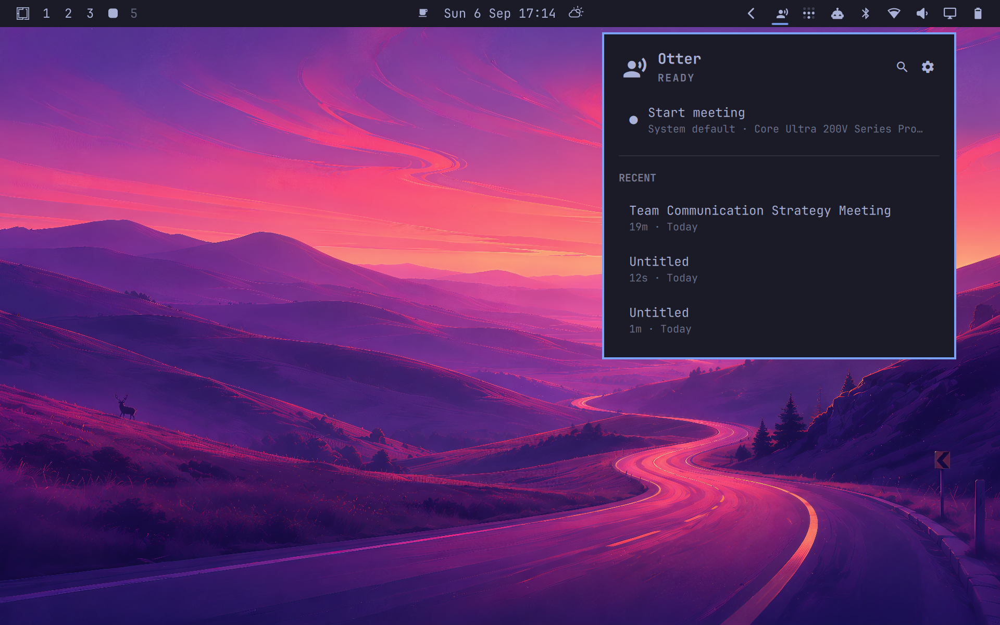

# Otter

A native [Omarchy](https://omarchy.org) plugin for [Otter.ai](https://otter.ai)
— meetings are recorded as they are detected and transcribed live, and your
recent conversations, transcripts and AI summaries live in the top bar —
without opening a browser or running a meeting bot.

Otter ships only a web app and a Chrome extension. The plugin talks to the same
private API the extension uses and presents it through Omarchy's own shell: a
themed Quickshell bar widget + panel, plus a small Python helper that handles
sign-in, the API, and PipeWire recording.



> ⚠️ Personal, unofficial, private. Built on Otter's private API (learned by
> reading the Chrome extension). Not affiliated with Otter.ai; may break if
> the API changes. Like every Omarchy plugin it runs unsandboxed with your
> user permissions — see [Privacy](#privacy) for exactly what it touches.

## What you get

- One minimal bar glyph. While recording it grows an elapsed timer and takes
  the theme's active colour — unmistakable without cluttering the bar.
- Start and stop from the panel, a keybinding, or a middle-click; while live,
  the panel shows the transcript as it arrives, an optional level meter, and
  upload progress.
- Your recent conversations, each opening to its full transcript in the panel —
  selectable text, an AI summary button, and a link out to Otter.
- Search (`/`) across everything you've recorded; email addresses in the query
  find a participant's meetings.
- Meeting detection: join a Meet/Zoom/Teams call and a toast offers to record
  it, counting down — no click needed, one click to cancel. Recording stops
  the same way when you leave. One setting switches to fully manual
  click-to-act; nothing ever records silently.
- No login flow: the plugin reuses the Otter session already in your browser
  (Chrome, Chromium, Brave, or Edge). Signing out is in the panel, with a
  confirm step.

## Requirements

Everything below is either stock Omarchy or one command away on Arch.

- **Omarchy** on the Quattro shell (plugin support).
- **Python 3** — the helper is standard library only; nothing to pip install.
- **ffmpeg** — captures microphone and system audio.
- **PipeWire** with `pactl` — Omarchy's default audio stack; lists and watches
  input devices.
- **libsecret** (`secret-tool`, package `libsecret`) with a running keyring —
  gnome-keyring on Omarchy — to read the browser's cookie-encryption key.
- **openssl** — decrypts the Otter session cookies.
- **A browser with an active otter.ai session**: Chrome, Chromium, Brave, or
  Edge. The plugin reuses that session; there is no separate login.

## Install

```sh
omarchy plugin add https://github.com/dharmapurikar/otter.git --enable
```

The glyph appears in the right section of the bar. With a valid browser
session your recent conversations show within a few seconds; otherwise the
panel opens on its sign-in view telling you which browser to sign in with.
Press `s` in the panel once to pick the microphone — empty means the system
default.

## Usage

- **Left-click** the glyph to open the panel, **right-click** to refresh
  conversations, **middle-click** to start or stop a recording.
- While recording, the panel streams the live transcript, an optional input
  meter, and upload progress.
- Meeting detection offers to record Meet, Zoom, Teams, Whereby, Jitsi, Slack
  huddles, and Discord calls after a 5-second countdown you can cancel.
- Everything is scriptable through the plugin's IPC target, e.g. for
  Hyprland keybindings:

  ```sh
  omarchy-shell io.github.dharmapurikar.otter recordToggle   # start/stop recording
  omarchy-shell io.github.dharmapurikar.otter toggle         # open/close the panel
  omarchy-shell io.github.dharmapurikar.otter record         # start
  omarchy-shell io.github.dharmapurikar.otter stop           # stop
  omarchy-shell io.github.dharmapurikar.otter setMic ""      # follow system default
  omarchy-shell io.github.dharmapurikar.otter status         # one-line state summary
  ```

  `bind = SUPER ALT, R, exec, omarchy-shell io.github.dharmapurikar.otter recordToggle` gives
  you push-to-record without touching the mouse.

## Configure

Settings live behind the gear in the panel: microphone, system-audio capture,
meeting detection and extra patterns, recording behaviour, browser and profile
holding the session, refresh interval, and the recent-conversations count.

```sh
omarchy bar move io.github.dharmapurikar.otter --section center   # relocate the widget
```

## Privacy

- Reads two cookies (`sessionid`, `csrftoken`) for otter.ai from the browser
  profile you name in settings, plus that browser's Safe Storage key from the
  system keyring. Nothing else in the profile is opened.
- Captures the microphone and — optionally — system audio through PipeWire,
  and uploads that audio to Otter for transcription. Recording never starts
  or stops silently: the default is a visible 5-second countdown with a
  one-click cancel, and the panel always shows a live state.
- Talks only to Otter's API endpoints (`otter.ai`, `api.aisense.com`). No
  telemetry, no other network peers.
- Unofficial and unsandboxed, like all Omarchy plugins: it runs with your
  user permissions. Audit it — the whole codebase is small on purpose.

## Remove

```sh
omarchy plugin remove io.github.dharmapurikar.otter
```

## Status

Working, and verified end to end on real hardware. Documentation in
[`docs/`](docs/):

- [docs/README.md](docs/README.md) — overview, how the pieces fit
- [docs/UI.md](docs/UI.md) — the widget and panel: every view, shortcut, and setting
- [docs/AUTH.md](docs/AUTH.md) — sign-in: how the browser session is reused
- [docs/ARCHITECTURE.md](docs/ARCHITECTURE.md) — how it works inside
- [docs/PROTOCOL.md](docs/PROTOCOL.md) — the Otter private API reference
- [docs/ROADMAP.md](docs/ROADMAP.md) — what's shipped, the backlog, what's deliberately not doing

Developers and AI agents working on the code should start with
[AGENTS.md](AGENTS.md).
