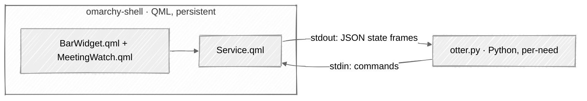
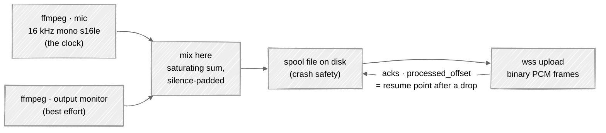

# Architecture

## Two layers, one seam

The plugin is deliberately split the same way Omarchy's own network-facing
plugins (Dropbox, Weather, Tailscale) are split:

1. **QML front-end** — runs *inside* the long-lived `omarchy-shell` Quickshell
   process. Presentation only. Reads the theme, draws the bar glyph and the
   panel, captures clicks and keys. It never opens a socket or touches a
   cookie.
2. **Python helper daemon** (`otter.py`) — a separate process the
   front-end spawns. It owns everything risky and slow: cookie auth, REST
   calls, the audio-upload WebSocket, PipeWire capture. It reports state back
   as newline-delimited JSON on stdout and takes commands on stdin.

The seam between them is a tiny JSON line protocol. Keeping the network and
audio work out of the shell process is not optional politeness — a crash or a
hang in the helper must never take down the bar.



## Why a helper process, not QML networking

Quickshell *can* do `XMLHttpRequest` and even WebSockets from QML, but:

- **Cookie decryption** needs the system keyring and AES — a Python job, not a
  QML one.
- **Recording** means pulling PCM from PipeWire, resampling to 16 kHz mono
  s16le, and pumping it through a resumable WebSocket with ack-tracking. That's
  a stateful audio pipeline; it belongs in a real process with real libraries.
- **Isolation.** The helper can be killed and restarted; the bar stays up.

This is exactly the Dropbox plugin's shape: its `Service.qml` shells out to a
`status.py` helper and parses JSON. We generalize that helper into a small
daemon because we also stream (recording), not just poll.

## Components

### `Service.qml` — the brain in the shell

Holds all observable state as QML properties the widget and panel bind to:

```
authenticated : bool    recording        : bool     pending          : bool
everLoaded    : bool    recordingOtid    : string   finishing        : bool
recent        : list    elapsedSec       : int      finishingLeftSec : real
lastError     : string  backlogSec       : real     sourceLabel      : string
devices       : list    level            : real     needsLogin       : bool
stdinMode     : string  commandable      : bool     micLabel         : string
micCaptures   : var     micInUseByOther  : bool     (meeting signal)

detailOtid / detailTitle + transcript{Text,Loading,Error}   (detail view)
summary{Text,Loading,Error}                                 (detail view)
searchQuery / searchResults / searchLoading / searchError   (search view)
liveText / liveConnected / liveError                        (while recording)
```

Responsibilities:

- Spawn the helper (a Quickshell `Process`) and restart it with exponential
  backoff if it dies, resetting the backoff once it stays healthy.
- Parse each JSON line from its stdout into the properties above; anything on
  the helper's stderr is a real fault and becomes `lastError`.
- Write one JSON command per action: `refresh`, `logout`, `devices`,
  `transcript`, `summarize`, `search`, `start`, `stop`.
- Persist settings (`micDevice`, `captureSystemAudio`, `showMeter`) through
  `bar.shell.updateEntryInline` into `shell.json`, rewriting the whole entry
  so sibling keys survive.
- Open Otter pages via `omarchy-launch-webapp` (recent items, the live
  conversation, the sign-in page).
- Tick `elapsedSec` locally while recording (resynced by the helper every
  second) and time out a start/stop that never gets confirmed after 15 s.
- Track `Pipewire.defaultAudioSource` live (via `PwObjectTracker`) so the
  panel names the real current default mic, not a stale cached one; a changed
  default also refreshes the device list.
- Own the `IpcHandler` target so `omarchy-shell io.github.dharmapurikar.otter <fn>` works from
  a keybinding: `open/close/toggle`, `record/stop/recordToggle`,
  `cancelCountdown`, `refresh`, `status`, `settings`, `setMic`, `devices`,
  `diagnostics`. (`omarchy.*` is reserved for first-party plugins, which
  `omarchy plugin validate` enforces.)

### `BarWidget.qml` — the entry point: bar button + panel

The manifest's `entryPoints.barWidget`. Its root is the shell's `Ui/Panel`,
which supplies the open/close lifecycle; the bar button (a `WidgetButton`) and
the popup (a `KeyboardPanel` + `Flickable`) live inside it, the way Omarchy's
own Dropbox plugin is arranged. The panel has **four views** — `main`,
`settings`, `detail`, `search` — with exactly one on screen at a time, so
growing capability never crowds the default view (see [UI.md](UI.md)):

- **main** — hero (mark, state, search + gear buttons), the sign-in row when
  signed out or the start/stop row when not, the level meter and LIVE tail
  while recording, an upload-backlog line only when actually behind, and the
  RECENT list.
- **settings** — microphone picker, the two audio toggles, and sign out.
- **detail** — one conversation's transcript (selectable `TextEdit`), with
  summarize and open-in-Otter actions.
- **search** — query field plus results.

Keyboard-navigable via the shell's cursor convention (`hasCursor`, `j/k`,
Enter, Esc), like every built-in panel. Esc unwinds one view level at a time.
The rows are small inline components (`SignInRow`, `StartMeetingRow`,
`MeetingRow`, `MicRow`, `SignOutRow`) defined at the bottom of the file, on
top of the shell's own `Ui/` kit (`PanelHero`, `Toggle`, `CursorSurface`, …).
Pure formatting helpers live in `Model.js` (unit-tested in
`test/model_test.mjs`); the mark is `OtterIcon.qml`.

### `MeetingWatch.qml` — meeting detection

A meeting is the conjunction of two signals: a Wayland toplevel that looks
like a meeting (the same source Omarchy's ActiveWindow widget reads — no
polling, no `hyprctl`), and — for apps that stay open all day like the
Teams PWA — a microphone capture held by that app, reported by the helper
as `call` frames. Window identity alone cannot work: the Teams window
never closes and its title does not change during a call, which is why
per-window prompting detected "first launch of Teams" and nothing after.
Join and leave are the *edges* of the conjunction — and a leave has to
*persist*: the conjunction must stay broken for three seconds before it
counts, because switching microphones inside a call app closes and
reopens the capture stream, and that blink is not a leaving.

With auto start/stop on (the default), it records and stops by itself
after a five-second countdown whose toast ticks live (replaced in place
via its notification id) and whose one click cancels; the resolved
countdown becomes the outcome toast. With it off, the same edges show
click-to-act toasts and nothing happens by itself. Countdowns
cross-cancel: a meeting ending before the auto-start fires cancels the
start, and rejoining during the stop countdown keeps the recording. See
[UI.md](UI.md) for the settings.

### The bar indicator

The minimal surface. Idle: one glyph in `bar.text`, dimmed when signed out.
Recording: the glyph tints to `bar.active` (theme urgent/accent) and an
`M:SS` timer counts up beside it. No dot — a running clock in the urgent
colour is already unmistakable, and "keep the indicators to a minimum" won.
Left-click toggles the panel, right-click refreshes, middle-click toggles
recording. No menu clutter. It uses `Ui/WidgetButton`, not `Ui/BarIconButton`:
the latter pins a fixed icon slot and would clip the timer.

### `otter.py` — the helper daemon

A single Python entry point with subcommands, but in normal operation the shell
runs it in **daemon mode** (`otter.py serve`), a long-lived loop reading
commands on stdin and emitting state on stdout. The same binary also offers
one-shot subcommands for scripting and debugging:

| Invocation | Use |
|---|---|
| `serve [--n 3] [--refresh 300]` | daemon mode, spoken to by `Service.qml` |
| `status [--n 3]` | auth state + recent conversations as JSON, exit |
| `transcript <otid> [--timestamps]` | plain-text transcript for a conversation |
| `search <query> [--n 10]` | search conversations (emails match participants) |
| `summarize <otid> [--prompt …]` | summarize via Otter's own LLM proxy |
| `devices` | list PipeWire inputs for the source picker |
| `selftest [--seconds 3]` | capture only: no network, audio counted then discarded |

Every subcommand prints one JSON object and exits 0, even on failure, so the
caller always has something to parse. Global flags: `--browser`, `--profile`,
`--no-cache`.

`selftest` exists because capture is the layer that actually breaks, and
proving it in isolation beats spending a real recording to find out.

Internally it's organized as:

```
helper/
  otter.py  CLI entry: cookie auth, REST client, subcommand dispatch
  serve.py          daemon: one select loop over stdin + audio + both sockets
  record.py         a recording: spool, upload, begin_stop/drain_done/finish
  audio.py          PipeWire capture via ffmpeg, device list, mixing, RMS
  ws.py             minimal RFC 6455 client (the stdlib has none)
  live.py           live transcript: speech_update socket + patch algorithm
```

`ws.py` is hand-rolled because no WebSocket client ships in the standard
library and the plugin's install story is "no pip step". It is narrow on
purpose: client role, text and binary frames, continuation reassembly,
ping/pong and close. Frames are parsed out of a buffer rather than read
field-by-field off the socket, because in a select loop a partial read would
otherwise consume the header and lose its place in the stream.

For the why behind each: cookie handling is [AUTH.md](AUTH.md); the REST
endpoints and both socket protocols are [PROTOCOL.md](PROTOCOL.md).

## The stdio line protocol

Newline-delimited JSON, one object per line, both directions.

**Helper → shell** (stdout), discriminated on `type`:

```json
{"type":"state","authenticated":true,"recording":false,"recent":[…],
 "stdinMode":"pipe","commandable":true,"needsLogin":false}
{"type":"started","otid":"…","sourceLabel":"…","elapsed":0}
{"type":"start_failed","errorClass":"device","message":"…"}
{"type":"recording","otid":"…","elapsed":47,"backlog":0.4}
{"type":"level","rms":0.42}
{"type":"call","captures":[{"name":"Microsoft Teams (PWA)","binary":"chrome","sourceName":"alsa_input.usb-…"}]}
{"type":"stopping","otid":"…","elapsed":312}
{"type":"finishing","otid":"…","remaining":0.4}
{"type":"stopped","otid":"…","url":"…","duration":312}
{"type":"stop_failed","errorClass":"internal","message":"…"}
{"type":"devices","devices":[{"name":"…","label":"Blue Microphones","isDefault":true}]}
{"type":"transcript","otid":"…","text":"…","error":""}
{"type":"summary","otid":"…","text":"…","error":""}
{"type":"results","query":"…","results":[…],"error":""}
{"type":"live","otid":"…","text":"…","connected":true}
{"type":"error","errorClass":"auth","message":"speech_start failed: 401"}
```

`started`/`start_failed` and `stopped`/`stop_failed` are terminal frames: mutating
commands complete with an explicit terminal outcome rather than treating command
transmission as success, so toasts only announce states the helper has confirmed.
Errors carry an `errorClass` (`auth` | `device` | `network` | `otter-api` | `internal`)
so the presentation layer renders actionable guidance and internal faults point to
`events.log`.

`stopping` and `finishing` exist because stopping is not instant: capture ends
at once but the last buffered frames still have to go out. Without them the
widget had no way to know the difference and sat there with a running clock,
still claiming to record. `stdinMode`/`commandable` report what the helper's
stdin actually is, so a broken command channel is diagnosable rather than
looking like "start does nothing". `needsLogin` marks being signed out as a
state rather than a fault — the panel shows a sign-in row, not red text.

`transcript`, `summary`, and `results` are one-shot request/reply frames: each
echoes the `otid` or `query` it answers, and the shell drops replies that no
longer match the view on screen, so a slow answer can never clobber a newer
one. `live` carries the running transcript tail (or its absence, with
`connected:false`); it is best-effort and recording never depends on it.
`call` carries the apps holding a microphone capture (Otter's own ffmpeg
and level peekers like the shell's audio panel excluded), emitted on
change — the meeting join/leave signal MeetingWatch correlates with its
window matching: the capture's binary must belong to the matched window's
app. Each capture also names the input it is bound to (`sourceName` —
which mic the app believes it is on), and a stream bound to an output
monitor does not count as a microphone at all. The helper polls every
2 s, so a leave is noticed within a couple of seconds — three, with the
confirmation window above. Every transition is also appended to
`~/.local/state/omarchy/otter/events.log` (JSON lines, rotated at
512 KiB): capture sets, mic switches, probes and finishes, so the next
incident is read off a log instead of reconstructed from notification
history.

**Shell → helper** (stdin), discriminated on `cmd`:
```json
{"cmd":"refresh"}
{"cmd":"start","micDevice":"","captureSystem":true}
{"cmd":"stop"}
{"cmd":"devices"}
{"cmd":"transcript","otid":"…"}
{"cmd":"search","query":"…","size":10}
{"cmd":"summarize","otid":"…"}
{"cmd":"note","event":"leave","label":"Microsoft Teams"}
{"cmd":"logout"}
{"cmd":"quit"}
```

An empty `micDevice` means "follow the system default", which needs no setup
and keeps working when headsets are swapped.

`note` is the shell's side of the events log: MeetingWatch's joins, leaves
(and leaves that were *pending* then cancelled by a returning capture),
countdown arming/firing/cancellation, daemon restarts and the silent
recording warning all arrive here and are appended to `events.log` as
`ui:*` events. While a recording runs, the helper also writes one `health`
line per minute (elapsed, upload backlog, peak RMS) — so "was the room
really silent?" is answered from the log, not from memory.

`level` frames are rate-limited (~10 Hz) and only sent while recording, so the
VU meter costs nothing when idle. If the meter turns out to be more trouble
than it's worth on a given machine, dropping `level` frames removes it with no
other effect.

## Recording data path



**One ffmpeg per source, mixed here — not a single ffmpeg with `amix`.**
`amix` waits for a frame from every input that has not reached EOF, so one
starved input stalls the whole graph: ffmpeg stays alive and healthy and
writes zero bytes for as long as the room is quiet, which is exactly how a
meeting starts. Driving the mix ourselves makes the microphone the clock and
lets a silent monitor contribute silence instead of blocking. The mix is a
saturating sum rather than an average, because halving both inputs to avoid
clipping makes quiet speech quieter, and quiet speech is what ASR struggles
with.

A device can also report unmuted, full volume and RUNNING while
delivering nothing at all (seen on a USB mic that was the system
default, while another app captured from a different one). A microphone
that produces no bytes for six seconds therefore triggers a *probe*:
every other real input is captured concurrently for ~2.5 s and the
recording switches to a live one — the system default first — keeping
the same conversation and spool, so the switch costs one short silence.
A mic that recovers during the probe keeps the recording untouched, and
after at most three switches the recording stays put rather than flap.
Only when no input delivers anything does the recording abort, loudly,
naming everything that was tried. Under the "follow the default"
policy a changed system default is followed once it settles (4 s), so
fixing audio mid-meeting does not leave the recording pinned to the
device that was abandoned. Silence here means *no bytes*: a quiet room
still streams digital silence and never trips this machinery — but a
recording that is silent in the loudness sense for five minutes gets
one "still recording, but silent" toast (never an automatic stop), the
guard for a leave signal that never arrives.

Audio is spooled to disk as it is captured. If the socket drops mid-recording
the helper reconnects and replays from the last acked offset — that is what
the acks are for, and the protocol is built for exactly this (see
[PROTOCOL.md](PROTOCOL.md)). A recording is therefore never lost to a flaky
network mid-meeting; worst case it finishes uploading slightly behind live.

**Finalizing does not wait for acks.** Stopping only requires that the audio
was *sent*; the extension sends `stop` and closes. Waiting for
acknowledgements made every stop hang for up to twenty seconds, so
completeness is keyed on sent bytes and only audio that never reached the wire
is kept on disk.

**Stopping never blocks the loop.** `begin_stop()` ends capture and returns,
`drain_done()` reports when the last bytes are out, and `finish()` closes the
socket and calls `speech_finish`. The daemon drives all three from its select
loop, so it keeps answering commands and reporting progress while a stop
completes. An earlier synchronous stop froze the loop and left the widget's
clock running with no feedback at all.

Sources are chosen by two settings: `micDevice` (empty = system default,
picked up automatically and always available; or a specific PipeWire input) and
`captureSystemAudio` (default on, mixes in the output monitor). A pinned mic
that vanishes falls back to the default rather than failing the recording.
Capturing the output monitor is *more* than the Chrome extension can do — it's
limited to a single tab; PipeWire gives us the whole system.

## Files on disk

| Path | Owner | Contents |
|---|---|---|
| `~/.config/omarchy/plugins/io.github.dharmapurikar.otter/` | user | the installed plugin, keyed by id |
| `~/.local/state/omarchy/otter/session.json` | helper | cached cookies + userid, `0600` |
| `~/.local/state/omarchy/otter/recordings/` | helper | append-only PCM spool per recording; kept only when audio never reached the wire |
| `~/.local/state/omarchy/otter/active.json` | helper | the recording in progress: otid, speech id, owning pid, acked offset. `0600`, written atomically |
| `~/.local/state/omarchy/otter/autostart.json` | helper | last meeting auto-recorded, for the cooldown |
| `~/.config/omarchy/shell.json` | shell | the widget's layout entry + its settings |

## One recording at a time

A helper killed mid-recording leaves its speech live on Otter **forever** — it
does not self-close (see PROTOCOL.md, "Live sessions"). A fresh helper starts
with no memory, and the first thing it does is tell MeetingWatch which apps
hold a microphone; if a call is still up, MeetingWatch reads that as a brand
new join and starts recording. Put those together and one shell restart during
a meeting produces two live sessions, two restarts produce three, and nothing
ever closes any of them. That happened: five recordings in ninety seconds,
four still live afterwards.

Four independent guards, deliberately overlapping, because the failure was
cheap to cause and expensive to notice:

1. **The marker.** `active.json` names the recording in progress and the pid
   that owns it, written atomically the moment the speech exists and refreshed
   with the acked offset on the same minute cadence as the health line. Its one
   reader is a process that exists *because* the writer was killed.
2. **Reconcile on startup.** Before the mic watch says a word, the helper
   reads the marker and sweeps the feed for live speeches. Anything live with a
   spool file on disk is ours and gets closed; anything live without one
   belongs to somebody else — the web app, a phone, OtterPilot — and is only
   reported. A sweep that cannot run (no session, no network) leaves the gate
   shut rather than concluding the world is clean, and retries on the next
   successful refresh. Nothing may auto-start until it has run.
3. **The start guard.** Every start re-sweeps. A live session that is not ours
   refuses the start and names it; one that is ours is closed first. A sweep
   that fails waves an explicit start through — a duplicate recording is
   recoverable, a meeting nobody recorded is not. A marker held by a *living*
   helper (two panels, or a restart that outran its predecessor) stands this
   one down entirely.
4. **Not dying badly in the first place.** SIGTERM, SIGINT and SIGHUP now run
   the graceful shutdown, which drains, sends the stop frame, posts
   `speech_finish` and clears the marker. A helper whose shell exited notices
   the reparenting and does the same, instead of lingering with the microphone
   open. SIGKILL remains uncatchable, which is what guards 1–3 are for.

Plus a cooldown, because MeetingWatch's own amnesia is the trigger: an
automatic start records where it happened, so the same meeting cannot be
auto-recorded twice within 90 s however many times the shell restarts. An
explicit click is never subject to it — a person asking to record always wins.

A start the helper declines this way answers `start_failed` with
`errorClass: "suppressed"`. The frame still has to go out so the widget's
pending flag clears, but the panel paints no error text and the toast says
"Not started" rather than "Recording failed": a decision of ours is not a
fault.

## Mapping to the Omarchy plugin system

`manifest.json` declares a single `bar-widget` kind whose `entryPoints.barWidget`
is `BarWidget.qml`. The widget owns its `Service` and `MeetingWatch` as
children (the Dropbox pattern). Settings — microphone, system-audio capture,
level meter, meeting detection, recents count, refresh interval, browser and
profile — are declared in `barWidget.schema` so they appear in Omarchy's
plugin settings UI and persist inline in `shell.json`; the ones the panel
changes itself are written back through `shell.updateEntryInline`. The full
manifest is in [UI.md](UI.md).
