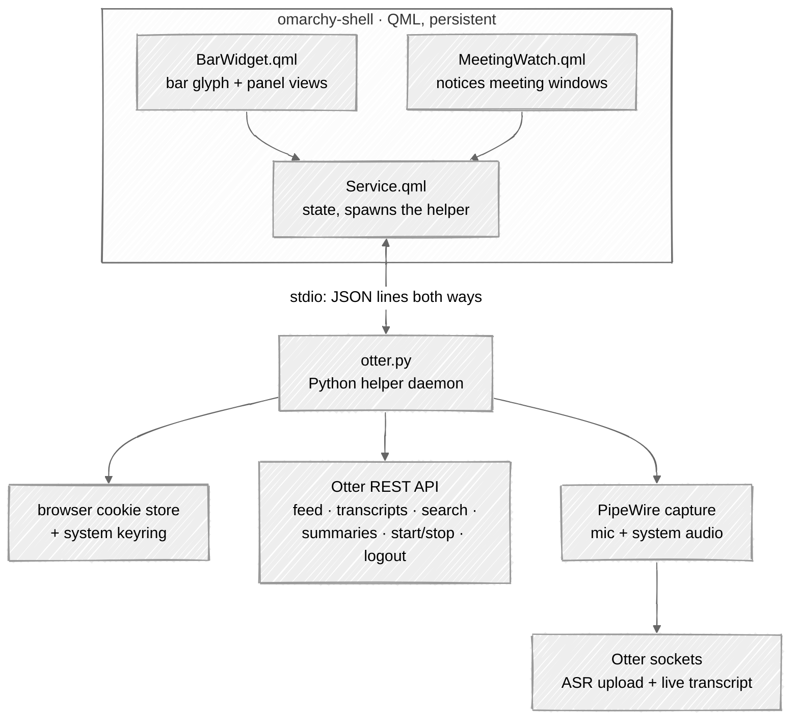

# Otter

A native [Omarchy](https://omarchy.org) plugin that brings Otter.ai into the
top bar — meetings are detected and recorded on a countdown you can cancel,
and your recent conversations, transcripts and AI summaries are a click away —
without opening a browser or running a meeting bot.

Otter ships only a web app and a Chrome extension. We can't change the native
client, so instead of wrapping the web app in a window, the plugin talks to
the same private API the Chrome extension uses and presents it through
Omarchy's own shell: a Quickshell bar widget and panel that inherit the active
theme, fonts, spacing, and corner radius like any first-party module.

> ⚠️ **Unofficial.** Everything here is built on Otter's private API, learned
> by reading the shipped Chrome extension (see [PROTOCOL.md](PROTOCOL.md)).
> Otter can change it without notice. Treat this as a personal-use integration,
> not a supported product.

## What it does

Everything below is implemented and was verified on real hardware:

- **One bar indicator, minimal.** A single otter glyph. While recording it
  gains a running timer and the theme's active colour — deliberately no dot.
  Fully themed, no baked-in colors. ([UI.md](UI.md))
- **Start / record / stop.** Start from the panel, a keybinding, or
  middle-click; the widget shows the elapsed timer, the tail of the live
  transcript, an optional level meter, and upload-backlog warnings. Stopping
  finishes the upload without ever blocking the panel.
- **Recent conversations.** The dropdown lists your latest conversations
  (three by default, up to six); clicking one opens its transcript in the
  panel, with summarize and open-in-Otter alongside.
- **Search** — `/` in the panel; email addresses in the query match
  participants rather than text.
- **Summaries** — through Otter's own LLM proxy: their endpoint, their quota,
  their model choice.
- **Meeting detection** — join a Meet/Zoom/Teams/… call and a countdown
  toast records it for you after five seconds (one click cancels); leaving
  stops it the same way. A setting turns the automation off for
  click-to-act toasts, and nothing ever records silently.
- **Settings in their own view** — microphone picker (system default or a
  pinned PipeWire input), system-audio capture, level meter, and sign out.

Explicitly **not** built: annotations, and calendar/virtual-assistant
auto-join. Auto-join was considered and **rejected**, not deferred: a Wayland
window gives no meeting URL to dispatch a bot to, and sending a bot into a
call is a consequence for everyone in the room — the native recorder covers
the same need without one. The API supports both ([PROTOCOL.md](PROTOCOL.md)).

## How the pieces fit

The split mirrors Omarchy's own Dropbox plugin: QML is presentation only; a
small helper process does the network and audio work and streams state back as
JSON. See [ARCHITECTURE.md](ARCHITECTURE.md).

## Login

No login flow — you're already signed into Otter in your browser. The plugin
reads the `sessionid` and `csrftoken` cookies straight from the browser's
cookie store (Chrome, Chromium, Brave, or Edge), decrypting them with the key
it keeps in your system keyring. The daemon probes the session on its own and
briskly notices when you sign back in; a manual check is
`python3 helper/otter.py status`. Signing out is in the panel's
settings view — two clicks, because it ends the browser's session too. Full
design and its trade-offs in [AUTH.md](AUTH.md).

## Documentation map

| Doc | Audience | What's in it |
|---|---|---|
| [UI.md](UI.md) | everyone | The bar widget and panel: views, shortcuts, settings |
| [AUTH.md](AUTH.md) | everyone | Sign-in: reusing the browser session, expiry, sign-out |
| [ARCHITECTURE.md](ARCHITECTURE.md) | technical | Components, process model, the stdio protocol |
| [ROADMAP.md](ROADMAP.md) | everyone | What's shipped, the backlog, what's deliberately not doing |
| [PROTOCOL.md](PROTOCOL.md) | technical | The private Otter API: endpoints, upload socket, live-transcript socket |
| [CONTRIBUTING.md](CONTRIBUTING.md) | contributors | Working on the code: what to read, how to test, what not to break |

## Status

Built and working — read-only widget, recording from PipeWire, settings,
transcripts, search, summaries, live transcript, and meeting detection, all
verified end to end on real hardware.
